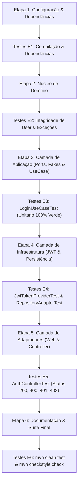

# Plano de Implementação — Autenticação via Login com JWT (Escapa! Backend)

Este documento estabelece o contexto, as diretrizes arquiteturais e o plano de ação detalhado para a implementação da funcionalidade de autenticação por e-mail e senha com geração de token JWT.

---

## 📌 1. Contexto e Objetivos

* **Objetivo Principal:** Autenticar usuários por e-mail e senha, gerando um token JWT assinado e retornando os dados necessários para o frontend efetuar o redirecionamento baseado no perfil de acesso.
* **Endpoint:** `POST /api/v1/auth/login` (público).
* **Perfis de Acesso (`profile`):**
  * `ADMIN`: Administrador geral da plataforma.
  * `COMPANY`: Empresa parceira.
  * `STUDENT`: Aluno regular.
  * `EMPLOYEE`: Aluno regular (`STUDENT`) que possui vínculo ativo em `users_company`. O frontend utiliza esse valor para redirecionar e ativar o modo somente leitura ([US-24](https://github.com/AGES-ESCAPA/Frontend/issues/105)).
* **Contrato de Token:**
  * JWT assinado com algoritmo HMAC-SHA256 utilizando segredo de variável de ambiente (`APP_JWT_SECRET`).
  * Claims do JWT: `sub` (ID do usuário), `email`, `role` (papel base) e `profile` (perfil derivado, permitindo verificação *stateless*).
  * Expiração configurável via `APP_JWT_EXPIRATION_MINUTES`.
* **Tratamento de Erros e Segurança:**
  * E-mail inexistente e senha incorreta retornam **401 Unauthorized** com a mesma mensagem (`"Invalid email or password"`), prevenindo enumeração de usuários.
  * Usuário com `status == INACTIVE` retorna **403 Forbidden**.
* **Padrão de Resposta:** Todas as respostas bem-sucedidas seguem o envelope padrão `ApiResponse<T>`.

---

## 🛡️ 2. Governança e Regras de Execução

1. **Separação Rígida de Camadas (Clean Architecture):**
   * O domínio (`domain/`) permanece puro, sem referências a Spring, JPA ou anotações de framework.
   * A aplicação (`application/`) contém apenas regras de orquestração e contratos de portas.
   * Os adaptadores (`adapters/`) lidam com DTOs, controllers e tratamento de erros HTTP.
   * A infraestrutura (`infrastructure/`) implementa persistência e serviços técnicos (JWT, hashing).
2. **Regra de Transição (Gate de Qualidade):**
   * **Implementação ➔ Testes ➔ Validação ➔ Próxima Etapa.**
   * Uma etapa só é considerada concluída e a seguinte só pode ser iniciada se **todos os testes associados e a suíte anterior estiverem 100% verdes** (`mvn test`).
3. **Conformidade de Estilo:**
   * Nenhuma violação de Checkstyle (`mvn checkstyle:check`).

---

## 🗺️ 3. Plano de Ação Passo a Passo



---

### 🔹 ETAPA 1: Infraestrutura de Configuração e Dependências

#### A. Implementação
1. No arquivo `pom.xml`:
   * Adicionar dependências do JJWT (`io.jsonwebtoken:jjwt-api:0.12.6`, `jjwt-impl:0.12.6`, `jjwt-jackson:0.12.6`).
2. No arquivo `src/main/resources/application.properties`:
   * Configurar:
     ```properties
     app.jwt.secret=${APP_JWT_SECRET:escapa-jwt-secret-key-development-minimum-256-bits-length}
     app.jwt.expiration-minutes=${APP_JWT_EXPIRATION_MINUTES:60}
     ```
3. No arquivo `.env.example`:
   * Adicionar as variáveis `APP_JWT_SECRET` e `APP_JWT_EXPIRATION_MINUTES`.

#### B. Testes e Validação do Gate
* Executar `mvn compile` para validar o download correto dos artefatos e garantir ausência de conflitos de dependências.
* **Critério de Aceite da Etapa 1:** Build Maven compila com sucesso (`BUILD SUCCESS`).

---

### 🔹 ETAPA 2: Núcleo de Domínio (`domain/`)

#### A. Implementação
1. Criar `com.escapa.backend.domain.user.UserStatus`:
   * Enum puro: `ACTIVE`, `INACTIVE`.
2. Atualizar `com.escapa.backend.domain.entity.User`:
   * Incluir campo `private UserStatus status = UserStatus.ACTIVE;`.
   * Preservar construtores existentes e adicionar getter/setter ou novos construtores para acomodar o status.
3. Criar Exceções de Domínio:
   * `com.escapa.backend.domain.user.InvalidCredentialsException`: estende `RuntimeException`.
   * `com.escapa.backend.domain.user.InactiveUserException`: estende `RuntimeException`.

#### B. Testes e Validação do Gate
* Criar/ajustar testes unitários do domínio para verificar:
  * Criação de `User` com status padrão `ACTIVE` e com status explícito `INACTIVE`.
  * Instanciação e mensagens das novas exceções de domínio.
* Executar os testes do domínio.
* **Critério de Aceite da Etapa 2:** Todos os testes de domínio passando e zero acoplamento a frameworks no pacote `domain/`.

---

### 🔹 ETAPA 3: Camada de Aplicação (`application/`)

#### A. Implementação
1. Atualizar a porta `UserRepositoryPort`:
   * `Optional<User> findByEmail(String email);`
   * `boolean isUserLinkedToCompany(UUID userId);`
2. Criar a porta `TokenProviderPort`:
   * `String generateToken(UUID userId, String email, String role, String profile);`
   * `long getExpirationSeconds();`
3. Criar DTO/Record de Saída de Aplicação:
   * `LoginOutput(String accessToken, String tokenType, long expiresIn, User authenticatedUser, String profile)`
4. Criar o caso de uso `LoginUseCase`:
   * Dependências: `UserRepositoryPort`, `PasswordHasherPort`, `TokenProviderPort`.
   * Fluxo:
     1. Normalizar o e-mail (`trim().toLowerCase()`).
     2. Validar obrigatoriedade de e-mail e senha (`InvalidCredentialsException` se nulos/vazios).
     3. Buscar usuário via `userRepositoryPort.findByEmail(normalizedEmail)` ➔ `InvalidCredentialsException` se não encontrado.
     4. Validar senha com `passwordHasherPort.matches(rawPassword, user.getPasswordHash())` ➔ `InvalidCredentialsException` se não coincidir.
     5. Validar status do usuário ➔ `InactiveUserException` se `status == UserStatus.INACTIVE`.
     6. Resolver perfil:
        * `role == "ADMIN"` ➔ `"ADMIN"`
        * `role == "COMPANY"` ➔ `"COMPANY"`
        * `role == "STUDENT"` ➔ verificar `userRepositoryPort.isUserLinkedToCompany(user.getId())` ? `"EMPLOYEE"` : `"STUDENT"`.
     7. Gerar token via `tokenProviderPort.generateToken(user.getId(), user.getEmail(), user.getUserType(), profile)`.
     8. Retornar `LoginOutput`.
5. Atualizar os Fakes de Teste em `src/test/.../application/usecase/`:
   * `InMemoryUserRepositoryPort`: implementar `findByEmail` e controle em memória de vínculos com empresa (`linkUserToCompany(UUID userId)`).
   * Criar `FakeTokenProviderPort`: retorna token determinístico `"mock-jwt-token"` e tempo fixo `3600L`.

#### B. Testes e Validação do Gate
* Criar `LoginUseCaseTest` com cobertura dos seguintes cenários:
  1. `shouldAuthenticateSuccessfullyAndReturnStudentProfile`: Aluno comum autentica com sucesso e recebe `profile = STUDENT`.
  2. `shouldAuthenticateSuccessfullyAndReturnEmployeeProfile`: Aluno com vínculo na empresa autentica e recebe `profile = EMPLOYEE`.
  3. `shouldAuthenticateSuccessfullyForAdminAndCompany`: Perfis diretos `ADMIN` e `COMPANY`.
  4. `shouldThrowInvalidCredentialsExceptionWhenEmailDoesNotExist`: E-mail não cadastrado lança 401 com mensagem padrão.
  5. `shouldThrowInvalidCredentialsExceptionWhenPasswordIsIncorrect`: Senha incorreta lança 401 com **a mesma mensagem** de e-mail inexistente.
  6. `shouldThrowInactiveUserExceptionWhenUserIsInactive`: Usuário inativo lança `InactiveUserException`.
  7. `shouldNormalizeEmailBeforeAuthenticating`: E-mail com maiúsculas e espaços ao redor é normalizado.
* Executar `mvn test -Dtest=LoginUseCaseTest`.
* **Critério de Aceite da Etapa 3:** Todos os 7 testes de `LoginUseCaseTest` 100% aprovados.

---

### 🔹 ETAPA 4: Camada de Infraestrutura (`infrastructure/`)

#### A. Implementação
1. Implementar `JwtTokenProviderAdapter` em `infrastructure/security`:
   * Implementa `TokenProviderPort`.
   * Lê `@Value("${app.jwt.secret}")` e `@Value("${app.jwt.expiration-minutes}")`.
   * Constrói token com `Jwts.builder()`, definindo `subject`, `claims` (`email`, `role`, `profile`), `issuedAt`, `expiration` e assinatura HMAC-SHA256.
2. Atualizar Repositórios e Mappers:
   * Em `UserJpaRepository`: declarar `Optional<UserEntity> findByEmail(String email);`.
   * Criar `UsersCompanyJpaRepository` (Spring Data JPA) com método `boolean existsByIdUserId(UUID userId);`.
   * Em `UserMapper`: mapear `status` de `UserEntity` para `User` e vice-versa.
   * Em `UserRepositoryAdapter`: injetar `UsersCompanyJpaRepository` e implementar `findByEmail` e `isUserLinkedToCompany`.
3. Atualizar `SpringConfig`:
   * Registrar os beans `TokenProviderPort` e `LoginUseCase`.

#### B. Testes e Validação do Gate
* Criar teste unitário `JwtTokenProviderAdapterTest` validando geração de token, decodificação das claims (`sub`, `email`, `role`, `profile`) e cálculo de expiração.
* Atualizar `UserRepositoryAdapterTest` validando as novas consultas.
* Executar `mvn test -Dtest=JwtTokenProviderAdapterTest,UserRepositoryAdapterTest`.
* **Critério de Aceite da Etapa 4:** Testes de infraestrutura verdes e beans do Spring devidamente registrados.

---

### 🔹 ETAPA 5: Camada de Adaptadores (`adapters/`)

#### A. Implementação
1. Criar DTOs em `com.escapa.backend.adapters.dto`:
   * `LoginRequest`:
     ```java
     public record LoginRequest(
         @NotBlank(message = "Email is required") @Email(message = "Invalid email format") String email,
         @NotBlank(message = "Password is required") String password
     ) {}
     ```
   * `LoginUserResponse`:
     ```java
     public record LoginUserResponse(UUID id, String name, String email, String profile) {}
     ```
   * `LoginResponse`:
     ```java
     public record LoginResponse(String accessToken, String tokenType, long expiresIn, LoginUserResponse user) {}
     ```
2. Criar `AuthController` em `com.escapa.backend.adapters.controller`:
   * Mapeamento `@PostMapping("/api/v1/auth/login")`.
   * Recebe `@Valid @RequestBody LoginRequest request`.
   * Executa `loginUseCase.execute(request.email(), request.password())`.
   * Retorna `ResponseEntity.ok(ApiResponse.success(response, "Operation completed successfully"))`.
3. Atualizar `GlobalExceptionHandler`:
   * Tratar `InvalidCredentialsException` ➔ retornar HTTP `401 UNAUTHORIZED`.
   * Tratar `InactiveUserException` ➔ retornar HTTP `403 FORBIDDEN`.

#### B. Testes e Validação do Gate
* Criar teste `AuthControllerTest` (MockMvc standalone ou WebMvcTest) testando:
  * Requisição com credenciais válidas retorna `200 OK` no formato esperado.
  * Requisição com payload inválido (e-mail em branco) retorna `400 BAD REQUEST`.
  * Requisição com credenciais inválidas retorna `401 UNAUTHORIZED`.
  * Requisição com usuário inativo retorna `403 FORBIDDEN`.
* Executar `mvn test -Dtest=AuthControllerTest`.
* **Critério de Aceite da Etapa 5:** Endpoints e tratamentos de erro validados e aprovados.

---

### 🔹 ETAPA 6: Documentação, Seeds e Validação Final

#### A. Implementação
1. Atualizar `README.md`:
   * Adicionar documentação do endpoint `POST /api/v1/auth/login`.
   * Documentar variáveis `APP_JWT_SECRET` e `APP_JWT_EXPIRATION_MINUTES`.
   * Documentar a senha padrão de todos os usuários do seed local (`escapa@2026`).
2. Tabela de Apoio para Testes Locais:

| Perfil / Cenário | E-mail no Seed | Senha | Status | Vínculo Empresa | Retorno Esperado |
| :--- | :--- | :--- | :--- | :--- | :--- |
| **ADMIN** | `barbara.diogo@escapa.com.br` | `escapa@2026` | `ACTIVE` | Não | `200 OK`, `profile: ADMIN` |
| **STUDENT** | `mariana.costa@email.com` | `escapa@2026` | `ACTIVE` | Não | `200 OK`, `profile: STUDENT` |
| **EMPLOYEE** | `luciana.prado@vistamar.com.br` | `escapa@2026` | `ACTIVE` | Sim (`Vista Mar`) | `200 OK`, `profile: EMPLOYEE` |
| **COMPANY** | `contato@vistamar.com.br` | `escapa@2026` | `ACTIVE` | Não | `200 OK`, `profile: COMPANY` |
| **INACTIVE** | `carla.menezes@email.com` | `escapa@2026` | `INACTIVE` | Não | `403 Forbidden` |
| **SENHA INVÁLIDA** | `mariana.costa@email.com` | `senha-errada` | `ACTIVE` | — | `401 Unauthorized` |
| **E-MAIL INVÁLIDO** | `inexistente@escapa.com` | `qualquer` | — | — | `401 Unauthorized` (mesma msg) |

#### B. Testes e Validação Final do Gate
* Executar a suíte completa de testes:
  ```bash
  mvn test
  ```
* Executar a verificação estrita de estilo e regras:
  ```bash
  mvn checkstyle:check
  ```
* **Critério de Aceite da Etapa 6:** Suíte de testes 100% verde (`BUILD SUCCESS`) e zero apontamentos no Checkstyle.

